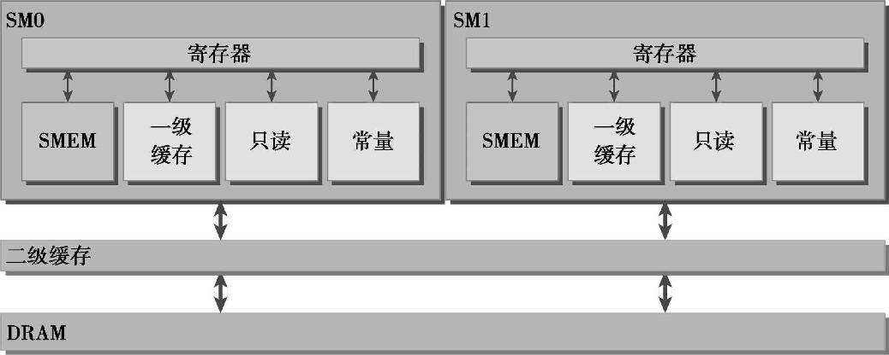

# 【学习笔记】CUDA C 编程权威指南

## 异构并行计算

### 并行计算

1. 串行与并行：如果一个任务处理的是另一个任务的输出，则他们是相关的（串行），否则就是独立的（并行）。
2. 并行有两种：
    - 任务并行：任务或函数独立并行，适用于利用多核系统进行任务分配。
    - 数据并行：同时处理多数据，重点在于利用多核系统对数据进行分配。—— 适用于 CUDA 编程   
3. 数据划分
    - 块划分
    - 周期划分
    
4. 计算机架构
    - CPU目前都是多核结构，其核心比较重，用于处理非常复杂的控制逻辑，以优化串行程序执行。  
    - GPU代表了一种众核架构，有很多核心，其并行结构有：多线程，MIMD（多指令多数据），SIMD，以及指令级并行。其核心比较轻，用于优化具有简单控制逻辑的数据并行任务，注重并行程序的吞吐量。

### 异构计算

1. 异构计算
CPU 和 GPU 是两个独立的处理器，它们通过单个计算节点中的 PCI-Express 总线相连。
    - 同构计算：使用同一架构下的一个或多个处理器来执行一个应用。
    - 异构计算：使用一个处理器架构来执行一个应用，为任务选择适合它的架构。
2. 异构架构

    - CPU 被称为主机端，CPU上执行的代码被称为 主机代码。———— 适合控制密集型任务
        - CPU 线程较重，操作系统必须交替线程使用启用或关闭 CPU 执行通道以提供多线程处理功能。上下文的切换缓慢且开销大。
    - GPU 被称为设备端，GPU上执行的代码被称为 设备代码。  ———— 适合计算密集型任务
        - GPU 线程高度轻量。GPU 在等待一组线程执行时，可以调用另一组线程执行其他任务。
    - 在设备端加载计算密集型任务之前，CPU 代码负责管理设备端的环境、代码和数据。
    - GPU 的性能评估：
        - 峰值计算性能：每秒能处理的单精度或双精度浮点运算的数量
        - 内存带宽：从内存中读取或写入数据的比率
3. CUDA：一种异构计算平台
CUDA 提供了两层 API 来管理 GPU 设备和组织线程
    - CUDA 驱动 API：驱动 API 是一种低级 API，相对较难编程，但对于在 GPU 设备使用上提供了更多的控制。
    - CUDA 运行时 API：是在驱动 API 的上层实现的高级 API。
    - 运行时 API 和驱动 API 没有明显的性能差异，而在设备端，如何使用内存以及如何组织线程，对性能有更显著的影响。
4. CPU 编程和 GPU 编程
    - 数据局部性：并行编程中的重要概念，指的是数据重用，以降低内存访问的延迟
        - 时间局部性：在相对较短的时间段内数据和/或资源的重用。
        - 空间局部性：在相对较接近的存储空间内数据元素的重用。
    - CPU 编程基于 CPU 架构，使用大容量缓存来优化具有良好空间局部性和时间局部性的应用。程序员必须处理低层的缓存优化，但由于线程在底层架构中的安排是透明的，所以无法优化。
    - CUDA 中有内存层次和线程层次的概念，这有助于对线程执行进行更高层次的控制和调度。

## CUDA 执行模型

### GPU 架构

1. 流式多处理器（SM）
    - GPU 架构是围绕一个流式多处理器（SM）的可扩展阵列搭建的。
    - GPU 拥有多个 SM，每个 SM 都能支持数百个线程并发执行。
    - 当启动一个内核网格时，线程块会被调度到可用的 SM 上执行。
    - 多个线程块可能会被分到同一个 SM 上，但一个线程块不会被分配到多个 SM 上。
    - SM 中，共享内存和寄存器是非常重要的资源。共享内存被分配在 SM 上的常驻线程块中，寄存器在线程中被分配。线程块中的线程通过这些资源可以进行相互的合作和通信。
    - 线程块内的线程是逻辑并行，而不是物理层面并行，实际上线程块内的不同线程可能会以不同的速度前进，这可能会导致多个线程使用未定义的顺序访问同一个数据，从而造成不可预测的行为。
    - 当线程束由于任何理由闲置时（如等待从设备内存中读取数值），SM 可从同一个 SM 上的常驻线程块中调度其他可用的线程束。而在并发的线程束间切换并没有开销，因为硬件资源已经被分配到了 SM 上的所有线程和块中，所以最新被调度的线程束状态已经存储在 SM 上。
    - 寄存器和共享内存是 SM 中的稀缺资源，CUDA 将这些资源分配到 SM 中的所有常驻线程里。这些资源限制了在 SM 上活跃的线程束数量，活跃的线程束数量对应于 SM 上的并行量。

2. 单指令多线程（SIMT）执行架构
    - CUDA 采用单指令多线程（SIMT）架构来管理和执行线程，每32个线程为一组，被称为**线程束（warp）**。
    - 线程束
        - 线程束中的所有线程同时执行相同的指令。
        - 每个线程都有自己的指令地址计数器，寄存器状态，以及可以有一个独立的执行路径。
        - 每个线程利用自身的数据执行当前的指令。
    - 每个 SM 都将所分配到的线程块划分为多个线程束执行。


3. Fermi 架构
    - 512 个加速器核心（CUDA 核心）
    - 每个核心包含一个全流水线的整数算术逻辑单元（ALU）和一个浮点运算单元（FPU）
    - 16 个 SM， 每个 SM 包含 32 个核心
    - 6 个384 位的 GDDR5 DRAM 存储器接口，支持多达 6 GB的全局机载内存。
    - 有一个耦合的 768 kb 的二级缓存，被 16 个 SM 所共享。
    - 每个多处理器有 16 个加载/存储单元（LD/ST），允许每个时钟周期内有 16 个线程计算源地址和目的地址。
    - 特殊功能单元（SFU）执行固有指令，如正弦，余弦，平方根和插值，每个时钟周期内的每个线程上执行一个固有指令。
    - 每个 SM 有两个线程束调度器和两个指令调度单元。
    - 有个 64 KB 的片内可配置存储器，在共享内存与一级缓存之间进行分配。
    - 计算性能2.x，可在每个 SM 上同时处理 48 个线程束，即可常驻 1536 个线程。

4. Kepler 架构
    - 15 个 SM 和 6 个 64 位的内存控制器
    - 创新：强化的 SM，动态并行，Hyper-Q 技术
    - 每个 SM 包含 192 个单精度 CUDA 核心， 64 个双精度单元（DP）， 32 个特殊功能单元（SFU）以及 32 个加载/存储单元（LD/ST）
    - 4 个线程束调度器和 8 个指令调度器，可同时发送执行4个线程束。
    - 计算能力 3.5，每个 SM 可调度 64 个线程束，即可同时常驻 2048 个线程。
    - 动态并行：运行 GPU 动态启动新的网格，无需借助 CPU。
    - Hyper-Q 增加了更多 CPU 和 GPU 之间的同步硬件连接。

### 理解线程束执行的本质

1. 线程束和线程块
    - 从逻辑角度看，线程块是线程的集合，可被组织为一维、二维或三维的布局。
    - 从硬件角度看，线程块是一维线程束的集合，每 32 个连续线程组成一个线程束。
2. 线程束分化
    - 一个线程束中的所有线程在同一周期中必须执行相同的指令。
    - 若同一线程束中的线程执行不同的指令，则发生线程束分化。此时，线程束将连续执行每一个分支路径，且在执行时禁用不执行这一路径的线程。
    - 尝试调整分支粒度以适应线程束大小的倍数，以此来避免线程束分化。
    - CUDA 编译器会有一些优化，即将短的，有条件的代码段的断定指令取代分支指令。这使得线程不会停止，只是遇到断定为 1 的指令执行，断定为 0 的指令不执行。
3. 资源分配
    - 由 SM 处理的每个线程束的执行上下文，在整个线程束的生存期中是保存在芯片内的。因此，执行上下文切换不会有损失。
    - 对于一个给定的内核，同时存在于同一个 SM 中的线程块和线程束的数量取决于在 SM 中可用的且内核所需的寄存器和共享内存的数量。
        - 每个线程消耗的寄存器越多，则 SM 可同时处理的线程束就越少。
        - 每个线程块消耗的共享内存越多，则 SM 可同时处理的线程块就越少。
    - 当计算资源（如寄存器和共享内存）已分配给线程块时，线程块称为活跃的块，其所包含的线程束被称为活跃的线程束。活跃的线程束有以下三种状态
        - 选定的线程束：调度执行的
        - 阻塞的线程束：未做好执行准备
        - 符合条件的线程束：已做好执行准备
    - 执行准备
        - 32 个 CUDA 核心可用于执行
        - 当前指令中所有参数都已就绪
    - 活跃线程束的上下文切换是无损耗的，为了最大程度的利用 GPU，需要最大化活跃的线程束数量。
4. 延迟隐藏
    - 当每个时钟周期中所有的线程调度器都有一个符合条件的线程束时，可达到计算资源的完全利用。
    - 延迟隐藏：GPU 的指令延迟被其他线程束的计算隐藏。
    - 指令延迟：在指令发出和完成之间的时钟周期。
        - 算术指令延迟：一个算术操作从开始到它输出之间的时间。算术操作为 10 - 20 个周期
        - 内存指令延迟：指发送出的加载或存储操作和数据到达目的地之间的时间。全局内存访问为 400 - 800 个周期。
    
    - 估算延迟隐藏：
        - 利特尔法则（Little’s Law）: `所需线程束数量 = 延迟 * 吞吐量`
        - 假设一条指令的平均延迟是 5 个周期，为了保持每个周期内执行 6 个线程束的吞吐量，则至少需要 30 个未完成的线程束。
    - 吞吐量和带宽
        - 带宽是理论峰值，吞吐量是已达到的值
        - 对于算术运算，所需的并行可以表示成隐藏算术延迟所需要的操作数量。例如，对于 Fermi GPU 而言，每个 SM 所需的线程束数量通过计算为 640 / 32 = 20 个。
        
        - 对于内存操作，所需的并行可表示为在每个周期内隐藏内存延迟所需的字节数。例如，对于 Fermi GPU，假设每个线程都把一浮点数据（4字节）从全局内存移动到 SM 中用于计算，则总共需要 74 KB / 4 字节 = 18500 个线程 = 579 个线程束。而 Fermi 有 16 个 SM，则每个 SM 需要 579 / 16 = 36 个线程束。
        
5. 网格和线程块大小准则
    - 保持每个块中线程数量是线程束大小（32）的倍数
    - 避免块太小：每个块至少要有 128 或 256 个线程
    - 根据内核资源的需求调整块大小
    - 块的数量要远远多于 SM 的数量
6. 同步
    - 系统级：`cudaDeviceSynchronize()`，阻塞主机应用程序，直至所有 CUDA 操作完成。
    - 块级：`__syncthreads()`，同一线程块中每个线程都必须等待直至该线程块中所有其他线程都已达到该同步点。会对性能产生负面影响。

### 展开循环

- CUDA 中，循环展开的意义非常重大，可减少指令消耗和增加更多的独立调度指令。
- 方法一：可让一个线程块手动展开两个或多个数据块的处理。
- 方法二：归约中，对最后的线程束进行操作展开
- 方法三：对循环进行完全展开，如果循环迭代次数是基于一个线程块维度的，完全展开归约循环是可能的。
- 方法四：模板函数的归约，在设备函数上 CUDA 支持模板参数，可通过模板控制编译代码量。
- `#pragma unroll`可提示 CUDA 编译器，将循环自动展开

### 动态并行

- 动态并行提供在 GPU 端直接创建工作的能力，允许在 GPU  端直接创建和同步新的 GPU 内核，可以减少主机和设备之间传输执行控制和数据的需求。
- 在动态并行中，内核执行分为：父母和孩子。
- 只有在所有的子网格都完成之后，父母才会完成。
- 动态并行只有在计算能力为 3.5 或更高的设备上才能被支持。
- 动态并行的最大嵌套深度限制为 24。

## 全局内存

### CUDA 内存模型概述

1. 内存层次结构的优点
    - 应用程序通常遵循局部性原则，即在任意时间点访问相对较小的局部地址空间。
        - 时间局部性：认为如果一个数据位置被引用，那么该数据在较短时间周期内很可能被再次引用，其概率随时间流逝而降低。
        - 空间局部性：认为如果一个内存位置被引用，则其附近的位置也可能会被引用。
    - 内存层次结构
    
    - GPU 和 CPU 在内存层次结构设计中都使用相似的准则和模型。二者主要区别是，CUDA 能将内存层次结构更好地呈现给用户让其控制行为。
2. CUDA 内存模型
    
    
    - 可编程的
        - 寄存器（低延迟，低带宽）
            - GPU 上运行速度最快的内存空间。
            - 可能存放的变量
                - 核函数中声明的无修饰符的自变量，通常存储在寄存器中。
                - 核函数声明的数组中，若用于引用该数组的索引是常量且能在编译时确定，则该数组也存储在寄存器中。
            - 寄存器变量对于每个线程来说都是私有的，寄存器变量与核函数的生命周期相同。
            - 寄存器是一个在 SM 中由活跃线程束划分出的较少资源。
            - 若一个核函数使用了超过硬件限制数量的寄存器，则会用本地内存替代多占用的寄存器。这种寄存器溢出会给性能带来不利影响。
        - 本地内存（高延迟，低带宽）
            - 核函数中符合存储在寄存器中但不能进入被该核函数分配的寄存器空间中的变量将溢出到本地内存。
            - 可能存放的变量：
                - 在编译时使用未知索引引用的本地数组
                - 可能会占用大量寄存器空间的较大本地结构体或数组
                - 任何不满足核函数寄存器限定条件的变量
            - 本质上与全局内存在同一块存储区域。因此是高延迟，低带宽。
        - 共享内存（低延迟，高带宽）
            - 共享内存由`__shared__`修饰，是片上内存。与本地内存或全局内存相比，有更高的带宽和更低的延迟。
            - 每个 SM 的共享内存有限，根据线程块分配，若过度使用，会限制活跃线程束的数量。
            - 共享内存的生命周期与线程块一致。
            - SM 中的一级缓存和共享内存都使用 64 KB 的片上内存，它通过静态划分，运行时可通过`cudaFuncSetCacheConfig()`来动态配置。
        - 常量内存
            - 由`__constant__`修饰，驻留在设备内存中，在每个 SM 专用的常量缓存中缓存。
            - 常量内存是静态声明，对同一编译单元中的所有核函数可见。
            - 线程束中所有线程从相同的内存地址中读取数据时，常量内存表现最好；若地址空间不同，且只读一次，则常量内存不适用。
        - 纹理内存
            - 驻留在设备内存中，并在每个 SM 的只读缓存中缓存。
            - 纹理内存是对二维空间局部性的优化，所以线程束里使用纹理内存访问二维数据的线程可达最优性能。
        - 全局内存（延迟最高）
            - 可在任何 SM  设备上访问到，贯穿应用程序整个生命周期。
            - 全局内存可以被静态声明或动态声明，`__device__`修饰符可静态声明一个变量。
            - 不同线程块内的多个线程并发修改全局内存的同一位置可能会出现未定义行为。
            - 全局内存常驻于设备内存，可通过 32 字节，64 字节或 128 字节的内存事务进行访问。这些内存事务必须自然对齐，即首地址必须是 32字节，64 字节或 128 字节的倍数。
            - 优化内存事务对于获得最优性能来说是至关重要的。当一个线程束执行内存加载/存储时，需要满足的传输数量通常取决于以下两因素：
                - 跨线程的内存地址分布
                - 每个事务内存地址的对齐方式
            - 一般情况下，用来满足内存请求的事务越多，未使用的字节被传输回的可能性就越高，会造成数据吞吐率的降低。
    
    - 不可编程的
        - 一级缓存：每个 SM 都有一个一级缓存
        - 二级缓存：所有的 SM 共享一个二级缓存
            - 一级和二级缓存都被用来存储本地内存和全局内存中的数据，也包括寄存器溢出的部分。
        - 只读常量缓存：每个 SM 都有一个
        - 只读纹理缓存：每个 SM 都有一个

### 内存管理

1. 内存分配和释放
    - 设备内存的分配和释放操作成本较高，应尽量重利用设备内存，以减少对整体性能的影响。
2. 固定内存
    - 主机内存的分配默认是 pageable（可分页），而 GPU 不能在可分页内存上安全地访问数据，因为当主机操作系统在物理位置上移动该数据时，它无法控制。因此，当从可分页主机内存传输数据到设备内存时，CUDA 驱动程序首先分配临时的页面固定的主机内存，将主机源数据复制到固定内存中，然后从固定内存传输数据给设备内存。
    - CUDA 运行直接分配固定主机内存：`cudaMallocHost()`，这些内存是页面锁定的且对设备来说是可访问的，它能用比可分页内存高得多的带宽进行读写。但分配过多的固定内存可能会降低主机系统的性能，因为它减少了用于存储虚拟内存数据的可分页内存数量。
    - 固定内存须用`cudaFreeHost()`来释放。
3. 零拷贝内存
    - 主机和设备都可以直接访问零拷贝内存。
    - CUDA 核函数的零拷贝内存优势
        - 当设备内存不足时可利用主机内存
        - 避免主机和设备间的显示数据传输
        - 提高 PCIe 传输率
    - 使用零拷贝内存时，必须同步主机和设备间的内存访问。另外，同时更改主机和设备的零拷贝内存中的数据将导致不可预知的后果。
    - 零拷贝内存是一种固定内存
        - 创建：`cudaHostAlloc(..., flag)`
        - `flag`设置：`cudaHostAllocMapped`
    - 若想共享主机和设备端的少量数据，零拷贝内存可能是个不错的选择，因为它简化了编程且有较好的性能。而对 PCIe 总线连接的离散 GPU 上的更大数据集，零拷贝内存会导致性能显著下降。
4. 统一虚拟寻址 （UVA）
    - 计算能力为 2.0 及以上版本的设备支持，在 CUDA 4.0 中被引用。
    - 通过 UVA，固定内存具有相同的主机和设备指针，因此可以直接将返回的指针传递给核函数使用。
5. 统一内存寻址
    - 在 CUDA 6.0中引入，用于简化 CUDA 编程模型中的内存管理。
    - 统一内存中创建了一个托管内存池，内存池中已分配的空间可以用相同的内存地址（即指针）在 CPU 和 GPU 上进行访问。底层系统会在统一内存空间中自动在主机和设备之间进行数据传输。；
    - 统一内存寻址依赖于 UVA 的支持，但它们是完全不同的技术。 UVA 为系统中的所有处理器提供了一个单一的虚拟内存地址空间，但 UVA 不会自动将数据从一个物理位置转移到另一个位置。
    - 托管内存指的是由底层系统自动分配的统一内存，与设备分配的内存可以互操作。所有在设备内存上有效的 CUDA 操作也同样适用于托管内存。
    - 托管内存可以被静态分配也可以被动态分配。
        - 静态声明：`__managed__`修饰符
        - 动态分配：`cudaMallocManaged()`

### 内存访问模式

CUDA 执行模型的显著特征之一就是指令必须以线程束为单位进行发布和执行。存储操作也是同样。在执行内存指令时，线程束中的每个线程都提供了一个正在加载或存储的内存地址。在线程束的 32 个线程中，每个线程都提出了一个包含请求地址的单一内存访问请求，它由一个或多个设备内存传输提供服务。

1. 对齐与合并访问

    - 全局内存通过缓存来实现加载/存储。
        - 所有对全局内存的访问都会通过二级缓存，也有许多访问会通过一级缓存，这取决于访问类型和 GPU 架构。
        - 如果两级缓存都被用到，那么内存访问是由一个 128 字节的内存事务实现的。
        - 如果只使用了二级缓存，则该内存访问时由一个 32 字节的内存事务实现的。
        - 一行一级缓存是 128 个字节，映射到设备内存中的一个 128 字节的对齐段。若线程束中的每个线程请求一个 4 字节的值，那么每次请求就会获取 128 字节的数据。
    - 优化应用程序时，需注意设备内存访问的两个特性
        - 对齐内存访问
            - 当设备内存事务的第一个地址是用于事务服务的缓存粒度的偶数倍数时（32 字节的二级缓存或 128 字节的一级缓存），就会出现对齐内存访问。运行非对齐的加载会造成带宽浪费。
        - 合并内存访问
            - 当一个线程束中全部的 32 个线程访问一个连续的内存块时，就会出现合并内存访问。
    - 理想状态：线程束从对齐内存地址开始访问一个连续的内存块。
2. 全局内存读取
    - 全局内存加载操作是否会通过一级缓存取决于两个因素
        - 设备的计算能力
        - 编译器选项
            - `Xptxas -dlcm=cg` 禁用一级缓存
            - `xptxas -dlcm=ca` 启用一级缓存
    - CPU 一级缓存和 GPU 一级缓存
        - CPU 一级缓存优化了时间和空间局部性
        - GPU 一级缓存是专为空间局部性
    - 内存加载访问模式
        - 缓存加载（启用一级缓存）：粒度为 128 字节，最理想是对齐与合并内存访问
            - 对齐/非对齐
            - 合并/非合并
        - 没有缓存的加载（禁用一级缓存）：粒度为 32 字节，可为非对齐或非合并的内存访问带来一定的总线利用率
    - 只读缓存（粒度为 32 字节）
        - 只读缓存最初预留给纹理内存使用，而计算能力为 3.5 以上的 GPU 的只读缓存也支持使用全局内存加载代替一级缓存。
        - 对于分散读取来说，这些更细粒度的加载要优于一级缓存。
        - 指导内存通过只读缓存进行读取
            - 使用函数`__ldg`
            - 在间接引用的指针上使用修饰符`__restrict__`
3. 全局内存写入
    - 一级缓存不能用于存储操作，在发送到设备内存之前存储操作只通过二级缓存。
    - 存储操作在 32 个字节的粒度上被执行。
    - 内存事务可被分为一段，二段或四段。
        - 若内存访问是对齐的，且线程束里所有的线程访问一个连续的 128 字节范围，则存储请求由一个四段事务实现；若是连续的 64 字节，则存储请求由一个二段事务实现。
        - 效果：四段 > 二段 > 一段
4. 结构体数组与数组结构体
    - 数组结构体（AoS）：存储空间上相邻的数据（如x和y）。

    ```c
    struct innerStruct{
        float x;
        float y;
    }

    struct innerStruct myAoS[N];
    ```

    - 结构体数组（SoA）：字段所有值被分到各自的数组中。

    ```c
    struct innerArray{
        float x[N];
        flaot y[N];
    }
    struct innerArray mySoA;
    ```

    - 用 SoA 模式存储数据容易利用 GPU 的内存带宽。
5. 性能调整
    - 优化设备内存带宽利用率有两个目标：
        - 对齐及合并内存访问，以减少带宽的浪费
        - 足够的并发内存操作，以隐藏内存延迟
            - 增加每个线程中执行独立内存操作的数量
            - 对核函数启动的执行配置进行实验，以充分体现每个 SM 的并行性。
    - 最大化带宽利用率
        - 有效利用设备 DRAM 和 SM 片上内存之间的字节移动：为了避免设备内存带宽的浪费，内存访问模式应是对齐和合并的。
        - 当前的并发内存操作数：可通过以下两点实现最大化当前存储器操作数。
            - 展开，每个线程产生更多的独立内存访问
            - 修改核函数启动的执行配置来使每个 SM 有更多的并行性。

## 共享内存和常量内存

### CUDA 共享内存

1. GPU 中有两种类型的内存
    - 板载内存：全局内存为代表，具有相对较高的延迟
    - 片上内存：共享内存为代表，具有相对较低的延迟
2. 共享内存的用途：
    - 块内线程通信的通道
    - 用于全局内存数据的可编程管理的缓存
    - 高速暂存存储器，用于转换数据以优化全局内存访问模式
3. 共享内存
    - 相对于全局内存：延迟要低约 20 - 30 倍，带宽要高约 10 倍
    - 每个线程束发出共享内存访问请求
        - 理想情况：每个被线程束共享内存访问的请求在一个事务中完成。
        - 最坏情况：每个共享内存的请求在 32 个不同的事务中顺序执行。
        - 若干多个线程访问共享内存中的同一个字，一个线程读取该字后，通过多播把它发给其他线程。
    - 共享内存被 SM 中的所有常驻线程块划分，因此共享内存是限制设备并行性的关键资源。一个核函数使用的共享内存越多，处于并发活跃状态的线程块就越少。
    - 共享内存分配
        - `__shared__`修饰符，可在核函数内部（作用域为该内核）和外部（作用域是全局的）进行声明。
        - 动态声明：若共享内存的大小在编译时是未知的，那么可以利用`extern`关键字声明一个未知大小的数组。然后在核函数调用时传入三重括号的第三个参数。（注意：只能动态声明一维数组）

        ```c
        extern __shared__ int tile[];
        kernel<<<grid, block, size * sizeof(int)>>> (...)
        ```

4. 共享内存存储体
    - 为了获得高内存带宽，共享内存被分为 32 个同样大小的内存模型，它们被称为存储体，可以被同时访问。32 是为了契合线程束的 32。
    - 共享内存是一个一维地址空间。
    - 根据 GPU 的计算能力，共享内存的地址在不同模式下会映射到不同的存储体中。
    - 若通过线程束发布共享内存加载或存储操作，且在每个存储体上只访问不多于一个的内存地址，那么该操作可由一个内存事务完成。否则，会由多个内存事务完成，就会降低内存带宽的利用率。
    - 存储体冲突：多个地址请求落在相同的内存存储体中，会导致请求被重复执行。
    - 线程束发出共享内存请求的模式
        - 并行访问：多个地址访问多个存储体
        - 串行访问：多个地址访问同一个存储体
        - 广播访问：单一地址读取单一存储体
    - 访问模式
        - 存储体的宽度
            - 规定了共享内存地址与共享内存存储体的对应关系。
            - 存储体宽度
                - 计算能力 2.x 的设备：4 字节（32 位）
                - 计算能力 3.x 的设备：8 字节（64 位）
            - 访问模式配置：默认是 4 字节宽度。`cudaDeviceGetSharedMemConfig()`中可配置`cudaSharedMemBankSizeFourByte`或者`cudaSharedMemBankSizeEightByte`。更改配置不影响共享内存使用量或核函数的占用率，但会影响性能。一个大的存储体可能为共享内存访问产生更高的带宽，但可能会导致更多的存储冲突。
            - 从共享内存地址到存储体索引的映射可如下计算（Fermi设备，宽度为 32 位，有 32 个存储体）
            `存储体索引 = （字节地址 / 4 字节） % 32 存储体`

        - 内存填充：避免存储体冲突的一种方法，在每 N 个元素之后添加一个字，此处 N 为存储体的数量，从而改变从字到存储体的映射。
    - 配置共享内存量：每个 SM 都有 64 KB的片上内存，由共享内存和一级缓存共享，可配置二者的分配：
        - 按设备进行配置
        - 按核函数进行配置
            - 当核函数使用较多的共享内存时，倾向于更多的共享内存
            - 当核函数使用更多的寄存器时，倾向于更多的一级缓存
    - 一级缓存与共享内存
        - 共享内存通过 32 个存储体访问，而一级内存通过缓存行进行访问。
        - 使用共享内存，对存储内容和存放位置有完全的控制权。而使用一级缓存，数据删除工作是由硬件完成的。
5. 同步
    - CUDA 提供了两种块内同步
        - 障碍：所有调用的线程等待其余调用的线程到达障碍点。
        - 内存栅栏：所有调用的线程必须等到全部内存修改对其余调用线程可见时才能继续执行。
    - 弱排序内存模型：内存访问不一定按照它们在程序中出现的顺序进行执行。
    - 显式障碍：`__syncthreads()`
        - 要求块中的线程必须等待直到所有线程都到达该点
        - 确保在该点之前，被这些线程访问的所有全局和共享内存对同一块中的所有线程都可见。
    - 内存栅栏
        - 确保栅栏前的任何内存写操作对栅栏后的其他线程都是可见的。
        - 内存栅栏 3 种创建方式
            - 块（共享内存和全局内存）：`void __threadfence_block();`
            - 网格（全局内存）：`void __threadfence();`
            - 系统（全局内存及其他所有内存）：`void __threadfence_system();`
    - `volatile` 修饰符：防止编译器优化，让编译器假定任何其他线程在任何时间都可以更改或使用该变量的值。
6. 共享内存的数据布局
    - 方形共享内存和矩形共享内存：可从二维线程索引中计算出一维内存偏移。
    - 行主序访问：`tile[threadIdx.y][threadIdx.x]`
    - 列主序访问：`tile[threadIdx.x][threadIdx.y]`
    - 行主序访问比列主序访问有更好的性能和更少的存储体冲突。
    - 使用填充的内核可提高性能，因为会减少存储体冲突
    - 带有动态声明共享内存的内核增加了少量的消耗    
7. 减少全局内存访问：例如，使用共享内存的并行归约。其中，展开的共享内存归约效果最好。
8. 合并的全局内存访问：避免对未合并的全局内存的访问，例如，矩阵转置。共享内存+展开+填充，能达到好效果。

### 常量内存

1. 专用于只读数据和同一访问线程束中线程的数据。
2. 位于设备的 DRAM（与主存位置一样），且有一个专用的片上缓存。每个 SM 常量内存缓存大小的限制为 64 KB。
3. 与其他类型的内存相比，常量内存有一个不同的最优访问模式：线程束中的所有线程都访问相同的位置。
4. 常量缓存与只读缓存
    - 在设备上都是只读
    - 每个 SM 上都有限：常量缓存是 64 KB，只读缓存是 48 KB
    - 常量缓存在统一读取中可以更好地执行（即线程束中每个线程都访问相同地址）
    - 只读缓存更适合分散读取。

### 线程束洗牌指令

1. 从 Kepler 系列的计算能力为 3.0 或更高的 GPU 开始，洗牌指令（shuffle instruction）作为一种机制被加入：只要两个线程在相同的线程束中，那么就允许这两个线程直接读取另一个线程的寄存器。
2. 洗牌指令使得线程束中的线程彼此之间可以直接交换数据，而不用通过共享内存或全局内存。因此，延迟更低，且不耗内存。
3. 束内线程（lane）索引计算：

```c
laneID = threadIdx.x % 32;
warpID = threadIdx.x / 32;
```

4. 洗牌指令
    - `int __shfl(int var, int srcLane, int width=warpSize)`，使得束内每个线程直接从一个特定的线程中获取某个值。
    
    - `int __shfl_up(int var, unsigned int delta, int width=warpSize)`，使得束内线程右移`delta`。
    
    - `int __shfl_down(int var, unsigned int delta, int width=warpSize)`，使得束内线程左移`delta`。
    
    - `int __shfl_xor(int var, int laneMask, int width=warpSize)`，使用`laneMask`执行按位异或。
    
    - 上述指令都基于整型，洗牌函数也支持单精度浮点数。
5. 洗牌指令应用场景
    - 跨线程束值的广播
    - 线程束内上移
    - 线程束内下移
    - 线程束内环绕移动
    - 跨线程束的蝴蝶交换
    - 跨线程束交换数组值
    - 跨线程束使用数组索引交换数值
    - 洗牌指令的并行归约

## 流和并发

### 流

1. CUDA 流是一系列异步的 CUDA 操作，这些操作按照主机代码确定的顺序在设备上执行。流能封装这些操作，保持操作的顺序，并且可以查询排队操作的状态。这些操作包括在主机与设备间进行数据传输，内核启动以及大多数由主机发起但由设备处理的其他命令。
2. 同一个流中的操作有严格的执行顺序，但不同流中的操作没有执行顺序限制（异步的）。因此在主机与设备系统中可用重叠执行其他操作，实现执行开销隐藏。
3. 所有 CUDA 操作（包括内核和数据传输）都在一个流中显式或隐式的执行。流分为两种类型：
    - 隐式声明的流（空流）：若未显式地指定一个流，则默认使用空流。
    - 显式声明的流（非空流）：非空流可以被显式地创建和管理。若想重叠使用不同的流，则须使用非空流。
        - 创建非空流：`cudaStreamCreate()`
        - 分配固定内存（异步传输时，须使用固定主机内存）：`cudaMallocHost()`，`cudaHostAlloc`
        - 数据传输：`cudaMemcpyAsync`
        - 内核启动：`kernel<<<grid, block, sharedMemSize, stream>>>(args...)`
        - 释放流资源：`cudaStreamDestroy`
        - 检查流操作是否完成：
            - `cudaStreamSynchronize`：强制阻塞主机
            - `cudaStreamQuery`：不会阻塞主机
            
4. 流操作在编程上并发，但不一定在硬件上实现并发
    - 数据传输：受 PCIe 总线限制，具有双工 PCIe 总线的设备可以重叠两个数据传输，否则只能串行执行一个。
    - 内核并发：依赖于设备，Fermi 支持 16 路并发，Kepler 支持 32 路并发。
5. 流调度：流并发受硬件调度限制
    - Fermi 的虚假依赖关系
    - Kepler 的 Hyper-Q 技术可以用多个硬件工作队列
6. 流的优先级 （计算能力 3.5 以上）
    - 创建优先级流：`cudaStreamCreateWithPriority`
    - 查询优先级：`cudaDeviceGetStreamPriorityRange`

### CUDA 事件

1. CUDA 事件本质上是 CUDA 流中的标记
2. 事件可执行以下两个基本任务：
    - 同步流的执行
    - 监控设备的进展
3. 事件
    - 声明：`cudaEvent_t event`
    - 创建：`cudaEventCreate`
    - 销毁：`cudaEventDestroy`
    - 记录：`cudaEventRecord`
    - 等待：`cudaEventSynchronize`
4. 案例：计算运行时间

```c
//create two events
cudaEvent_t start,stop;
cudaEventCreate(&start);
cudaEventCreate(&stop);

//record start event on the default stream
cudaEventRecord(start);

//execute kernel
kernel<<<grid, block>>>(args...);

//record stop event on the default stream
cudaEventRecord(stop);

// wait util the stop event complete
cudaEventSynchronize(stop);

// calculate the elapsed time between two events
float time;
cudaEventElapsedTime(&time, start, stop);

// clean up the two events
cudaEventDestroy(start);
cudaEventDestroy(stop);
```

### 流同步

1. 在主机上，非空流是一个异步流，其上所有操作都不阻塞主机执行。
2. 被隐式声明的空流是主机上的同步流，大多数操作都会阻塞主机。
    - 非空流有两种类型
        - 阻塞流：流中操作可被空流阻塞
        - 非阻塞流：流中操作不会被空流阻塞
3. 隐式同步
    - 锁页主机内存分配
    - 设备内存分配
    - 设备内存初始化
    - 同一设备上两个地址之间的内存复制
    - 一级缓存/共享内存配置的修改
4. 显式同步
    - 同步设备：`cudaDeviceSynchronize`
    - 同步流：`cudaStreamSynchronize`，`cudaStreamQuery`
    - 同步流中的事件：`cudaEventSynchronize`，`cudaEventQuery`
    - 使用事件跨流同步：`cudaStreamWaitEvent`

## 调整指令级原语

### CUDA 指令概述

1. 浮点指令：与 C 的表示一样，存在精度问题
    - `nextafterf`可从一个给定值找到下一个最高位浮点数
2. 内部函数和标准函数
    - 标准函数：用于支持可对主机和设备进行访问并标准化主机和设备的操作
    - 内置函数：只能对设备代码进行访问，编译时对它的行为会有特殊响应（优化）。
        - `__dsqrt_rn` -- `sqrt`
        - `__fdividef` -- `/`
    - 内部函数比等价的标准函数更快，但可能数据精确度会更低。
3. 原子操作指令
    - 确保数学运算的原子性
    - 原子运算函数分为 3 种
        - 算术运算函数
        - 按位运算函数
        - 替换函数
    - 原子函数没有精度上的顾虑，但可能会严重降低性能。

### 程序优化指令

1. 单精度与双精度比较
    - 双精度数值的精确性是以空间和性能消耗为代价的
    - 双精度数值能使总程序运行时间增加近一倍。
    - 在设备端进行数据通信的时间也是增加近一倍。
    - CUDA 和 GPU 独有特性
        - 双精度增加主机与设备之间的通信
        - 双精度增加全局内存的输入/输出
        - 数值精度的损失是由 CUDA 编译器强制浮点数优化导致
    
2. 标准函数与内部函数的比较

    - 内部函数比标准函数，速度更快，但可能精度更低
    - 主机和设备上的浮点运算都存在固有的不精确性
    - 指令级优化
        - 编译器标志
        
        - 内部或标准函数调用
3. 了解原子指令
    - CUDA 提供的原子函数的关键：原子级比较并交换（CAS）运算符。
    - CAS 将三个内容作为输入：内存地址，存储在此处的期望值，实际想要存储在此的新值。`int atomicCAS(int *address, int compare, int val);`
    - CAS 仅当当前存储值与期望值相同时才执行
    - CAS 的返回值是目标地址的值，其返回值可以用于检验 CAS 是否成功。
    
    ```c
    __device__ int myAtomicAdd(int *address, int incr){
        int expected = *address;
        int oldValue = atomicCAS(address, expected, expected + incr);
        
        while(oldValue != expected){
            expected = oldValue;
            oldValue = atomicCAS(address, expected, expected + incr);
        }
    }
    ```
    
    - 内置 CUDA 原子函数
    
    - 原子操作的成本
        - 当在全局或共享内存中执行原子操作时，能保证所有数值变化对所有线程都是立即可见的。
        - 共享地址冲突的原子访问可能要求发生冲突的线程不断地进行重试。
        - 一个线程束内多个线程在相同的内存地址发出一个原子操作，则会产生类似线程冲突的问题。
    - 可使用局部操作来限制全局原子操作的性能成本。
    